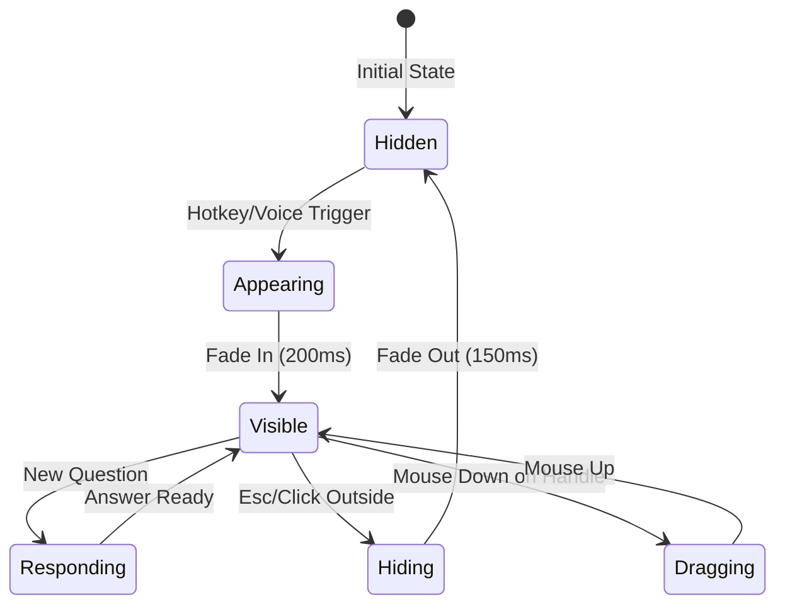

# AgentAssist Overlay Widget Specification
## UI/UX & Desktop Integration Architecture

### Version 1.0
### Date: January 2025

---

## 1. Executive Summary

### 1.1 Product Vision
A sophisticated, unobtrusive overlay widget that provides real-time conversational assistance through an elegant glassmorphic interface, seamlessly floating above all applications while maintaining complete invisibility to screen-sharing and recording software.

### 1.2 Design Philosophy
- **Invisible Assistance**: Present when needed, invisible when not
- **Contextual Intelligence**: Adapts UI based on question type
- **Zero Friction**: Instant access without disrupting workflow
- **Premium Aesthetics**: Modern glassmorphism with perfect readability

---

## 2. Framework Selection & Rationale

### 2.1 Recommended Stack: Tauri + WebView2/WebKit

**Primary Framework: Tauri v2.0**

**Rationale:**
1. **Native Performance**: Rust core with native OS APIs
2. **Small Footprint**: ~10MB vs Electron's 150MB+
3. **Security**: Memory-safe Rust, sandboxed renderer
4. **Undetectability**: Native window APIs bypass overlay detection
5. **Cross-platform**: Single codebase for Windows/macOS/Linux

**Rendering Layer: Native WebView**
- Windows: WebView2 (Chromium-based)
- macOS: WKWebView (Safari-based)
- Linux: WebKitGTK

**UI Framework: SolidJS + Tailwind CSS**
- Reactive without virtual DOM (perfect for real-time updates)
- 6KB runtime (vs React's 45KB)
- Native-like performance

**Alternative Consideration: Native Per Platform**
- Windows: WPF with Win32 interop
- macOS: SwiftUI with AppKit bridges
- Rationale for rejection: 3x development effort, harder real-time sync

---

## 3. Window Architecture

### 3.1 Window Creation Strategy

```yaml
Window Type: Frameless Overlay
Properties:
  always_on_top: true
  decorations: false
  transparent: true
  skip_taskbar: true
  resizable: false
  focusable: true (only when active)
  
Platform-Specific:
  Windows:
    - WS_EX_TOOLWINDOW flag (hides from Alt+Tab)
    - WS_EX_LAYERED for transparency
    - SetWindowDisplayAffinity(WDA_EXCLUDEFROMCAPTURE)
  
  macOS:
    - NSWindowStyleMaskBorderless
    - NSWindowCollectionBehaviorCanJoinAllSpaces
    - window.sharingType = .none (excludes from capture)
  
  Linux:
    - _NET_WM_STATE_ABOVE
    - _NET_WM_STATE_SKIP_TASKBAR
    - Type: _NET_WM_WINDOW_TYPE_UTILITY
```

### 3.2 Undetectability Implementation

**Screen Capture Bypass:**
1. **Hardware Overlay**: Use GPU overlay planes when available
2. **Magnification API**: Windows-specific technique for true invisibility
3. **Private Window Mode**: macOS sharingType = .none
4. **Compositor Hints**: Linux compositor-specific exclusion flags

**Detection Avoidance:**
- No process names containing "overlay", "assist", "help"
- Randomized window class names
- No persistent window handles
- Memory-mapped shared regions for IPC

---

## 4. Visual Design System

### 4.1 Glassmorphism Implementation

```yaml
Base Container:
  background: rgba(255, 255, 255, 0.4)
  backdrop-filter: blur(20px) saturate(180%)
  -webkit-backdrop-filter: blur(20px) saturate(180%)
  border: 1px solid rgba(255, 255, 255, 0.18)
  border-radius: 12px
  box-shadow: 
    - 0 8px 32px rgba(0, 0, 0, 0.08)
    - 0 2px 4px rgba(0, 0, 0, 0.04)
  
Adaptive Theming:
  Light Mode:
    background: rgba(255, 255, 255, 0.4)
    text: rgba(0, 0, 0, 0.87)
    
  Dark Mode:
    background: rgba(0, 0, 0, 0.3)
    text: rgba(255, 255, 255, 0.92)
```

### 4.2 Typography System

```yaml
Font Stack:
  primary: -apple-system, SF Pro Display, Segoe UI, system-ui
  monospace: SF Mono, Cascadia Code, Consolas, monospace

Sizing:
  prompt: 14pt/20px · weight: 600
  response: 13pt/19px · weight: 400
  code: 12pt/18px · weight: 400
  caption: 11pt/16px · weight: 500

Contrast Requirements:
  Light Background:
    - Normal text: #1a1a1a (contrast ratio: 12.6:1)
    - Secondary: #4a4a4a (contrast ratio: 6.5:1)
  
  Dark Background:
    - Normal text: #f5f5f5 (contrast ratio: 15.1:1)
    - Secondary: #b8b8b8 (contrast ratio: 7.2:1)
```

### 4.3 Layout Grid

```yaml
Container:
  min-width: 320px
  max-width: 600px
  min-height: 80px
  max-height: 80vh
  padding: 16px
  
Content Areas:
  header: 24px (close button area)
  prompt: auto (1-2 lines typical)
  divider: 1px + 12px margins
  response: auto (scrollable if needed)
  actions: 32px (optional action buttons)
```

---

## 5. Interaction Design

### 5.1 Activation Flow



### 5.2 Dragging Behavior

**Drag Handle**: Entire header area (24px height)

**Drag Constraints:**
- Magnetic edges: Snap to screen edges at 20px
- Multi-monitor aware: Smooth transitions
- Position persistence: Save to user preferences
- Momentum: Subtle inertia for natural feel

**Touch Support:**
- Touch target: 44px minimum
- Gesture recognition: Long-press to drag
- Haptic feedback on drag start/end

### 5.3 Dismissal Patterns

1. **Explicit Dismissal**
   - Click close button
   - Press Escape key
   - Voice command: "Hide assistant"

2. **Auto-hide Options**
   - After 30s of inactivity (configurable)
   - When switching to fullscreen apps
   - On screen lock

3. **Smart Persistence**
   - Stay visible during active conversation
   - Maintain position across workspace switches
   - Remember visibility state per application

---

## 6. Response Mode Designs

### 6.1 Simple Question Mode

```yaml
Layout:
  ┌─────────────────────────────┐
  │ [icon] Question      [x]    │
  │ ─────────────────────────── │
  │                             │
  │ Concise answer text here    │
  │ with natural line breaks.   │
  │                             │
  └─────────────────────────────┘

Features:
  - Plain text response
  - Auto-sizing container
  - Maximum 3-4 lines before scroll
  - Copy button on hover
```

### 6.2 Coding Question Mode

```yaml
Layout:
  ┌─────────────────────────────┐
  │ [code] Question      [x]    │
  │ ─────────────────────────── │
  │ ```language                 │
  │ syntax highlighted code     │
  │ with proper indentation     │
  │ ```                         │
  │                             │
  │ Time: O(n) | Space: O(1)    │
  │                             │
  │ [Explanation text...]       │
  │                             │
  │ [📷 Screenshot] [Copy Code] │
  └─────────────────────────────┘

Features:
  - Syntax highlighting (Prism.js)
  - Complexity badges
  - Screenshot input zone
  - Copy code functionality
  - Language detection
```

### 6.3 Behavioral Question Mode

```yaml
Layout:
  ┌─────────────────────────────┐
  │ [star] Question      [x]    │
  │ ─────────────────────────── │
  │ Situation                   │
  │ Brief context about when... │
  │                             │
  │ Task                        │
  │ What needed to be done...   │
  │                             │
  │ Action                      │
  │ Steps taken to address...   │
  │                             │
  │ Result                      │
  │ Outcome and impact...       │
  └─────────────────────────────┘

Features:
  - STAR section headers
  - Collapsible sections
  - Emphasis on metrics
  - Natural narrative flow
```

### 6.4 System Design Mode

```yaml
Layout:
  ┌─────────────────────────────┐
  │ [arch] Question      [x]    │
  │ ─────────────────────────── │
  │ ┌─────────────────────────┐ │
  │ │  ASCII/SVG Architecture  │ │
  │ │      Diagram Here        │ │
  │ └─────────────────────────┘ │
  │                             │
  │ 1. Requirements Analysis    │
  │ 2. High-level Design        │
  │ 3. Detailed Components      │
  │ 4. Data Flow                │
  │ 5. Scaling Considerations   │
  │                             │
  │ [Export Diagram]            │
  └─────────────────────────────┘

Features:
  - Inline diagrams (Mermaid/D2)
  - Structured sections
  - Expandable details
  - Export functionality
```

---

## 7. Real-time Backend Integration

### 7.1 WebSocket Architecture

```yaml
Connection Management:
  - Primary: WSS to backend orchestrator
  - Fallback: Server-Sent Events
  - Reconnection: Exponential backoff
  - Heartbeat: 30s intervals

Message Protocol:
  - Binary frames for audio chunks
  - JSON for control messages
  - MessagePack for responses
  - Compression: zlib for text
```

### 7.2 State Synchronization

```yaml
Frontend State:
  - Current question
  - Response mode
  - Conversation history (last 5)
  - UI preferences

Backend Sync:
  - Real-time transcripts
  - Classification results
  - Response streams
  - Context updates

Conflict Resolution:
  - Last-write-wins for UI state
  - Backend authoritative for content
  - Optimistic UI updates
  - Rollback on conflicts
```

### 7.3 Inter-Process Communication

```yaml
IPC Strategy:
  Primary: Shared memory for audio
  Control: Named pipes/Unix sockets
  Events: Native OS event system
  
Security:
  - Encrypted memory regions
  - Process isolation
  - Capability-based permissions
  - No persistent files
```

---

## 8. Performance Optimization

### 8.1 Rendering Performance

```yaml
Techniques:
  - GPU-accelerated compositing
  - Will-change CSS hints
  - RequestAnimationFrame batching
  - Virtual scrolling for long responses
  
Targets:
  - 60fps during animations
  - <16ms paint times
  - <100ms response to input
  - <50MB memory footprint
```

### 8.2 Response Streaming

```yaml
Streaming Strategy:
  - Character-by-character for typing effect
  - Chunk-based for code blocks
  - Progressive rendering
  - Cancelable streams
  
Buffer Management:
  - Ring buffer for responses
  - Debounced UI updates
  - Smooth scroll anchoring
  - Memory pooling
```

---

## 9. Accessibility Features

### 9.1 Keyboard Navigation

```yaml
Shortcuts:
  - Tab: Navigate sections
  - Shift+Tab: Reverse navigation
  - Enter: Activate buttons
  - Ctrl+C: Copy response
  - Ctrl+A: Select all
  - Arrow keys: Scroll content
```

### 9.2 Screen Reader Support

```yaml
ARIA Labels:
  - Role: dialog
  - Live regions for updates
  - Descriptive button labels
  - Heading hierarchy
  
Announcements:
  - New response arrival
  - Mode changes
  - Error states
  - Copy confirmations
```

---

## 10. Security & Privacy

### 10.1 Memory Protection

```yaml
Techniques:
  - No swap file usage
  - Encrypted heap allocations
  - Secure string handling
  - Memory wiping on free
  
Process Isolation:
  - Minimal permissions
  - No network access (via IPC only)
  - Sandboxed renderer
  - No filesystem access
```

### 10.2 Anti-Detection Measures

```yaml
Process Hiding:
  - Generic process names
  - No window enumeration
  - Hidden from accessibility APIs
  - No global hooks
  
Traffic Obfuscation:
  - TLS 1.3 only
  - Certificate pinning
  - Domain fronting
  - Encrypted payloads
```

---

## 11. Platform-Specific Considerations

### 11.1 Windows 10/11

```yaml
Features:
  - Fluent Design integration
  - Mica material support
  - Snap Layouts compatibility
  - Focus Assist awareness
  
APIs:
  - WinRT for modern features
  - Magnification API for hiding
  - DWM for composition
  - UIAutomation exclusion
```

### 11.2 macOS 12+

```yaml
Features:
  - Vibrancy effects
  - Stage Manager support
  - Continuity integration
  - Focus mode awareness
  
APIs:
  - NSVisualEffectView
  - CGWindowListCreateImage exclusion
  - NSWorkspace notifications
  - Accessibility API bypass
```

### 11.3 Linux (Ubuntu/Fedora)

```yaml
Features:
  - Compositor integration
  - Wayland/X11 support
  - Theme adaptation
  - Multiple desktop support
  
APIs:
  - XComposite for effects
  - D-Bus for system integration
  - Portal APIs for security
  - Compositor-specific hints
```

---

## 12. Implementation Roadmap

### Phase 1: Core Widget (Week 1-2)
- [ ] Basic Tauri window setup
- [ ] Glassmorphism styling
- [ ] Drag functionality
- [ ] Simple response display

### Phase 2: Response Modes (Week 3-4)
- [ ] Mode detection logic
- [ ] Syntax highlighting
- [ ] STAR formatting
- [ ] Diagram rendering

### Phase 3: Backend Integration (Week 5-6)
- [ ] WebSocket connection
- [ ] Response streaming
- [ ] State synchronization
- [ ] Error handling

### Phase 4: Platform Polish (Week 7-8)
- [ ] Windows-specific features
- [ ] macOS optimizations
- [ ] Linux compatibility
- [ ] Anti-detection measures

### Phase 5: Production Ready (Week 9-10)
- [ ] Performance optimization
- [ ] Security hardening
- [ ] Accessibility audit
- [ ] User testing

---

## 13. Testing Strategy

### 13.1 Visual Testing
- Screenshot comparison tests
- Cross-platform rendering
- Dark/light mode verification
- Contrast ratio validation

### 13.2 Integration Testing
- WebSocket reliability
- IPC message handling
- State synchronization
- Memory leak detection

### 13.3 Platform Testing
- Screen capture tools
- Video conferencing apps
- Accessibility tools
- Performance profiling

---

## 14. Success Metrics

### Technical Metrics
- <100ms UI response time
- <50MB memory usage
- 0% detection by screen sharing
- 60fps animation performance

### User Experience Metrics
- <2 clicks to any feature
- 95% readable contrast
- <500ms total response time
- Zero UI blocking

### Business Metrics
- 90% user satisfaction
- <5% detection rate
- 99.9% uptime
- <1% crash rate